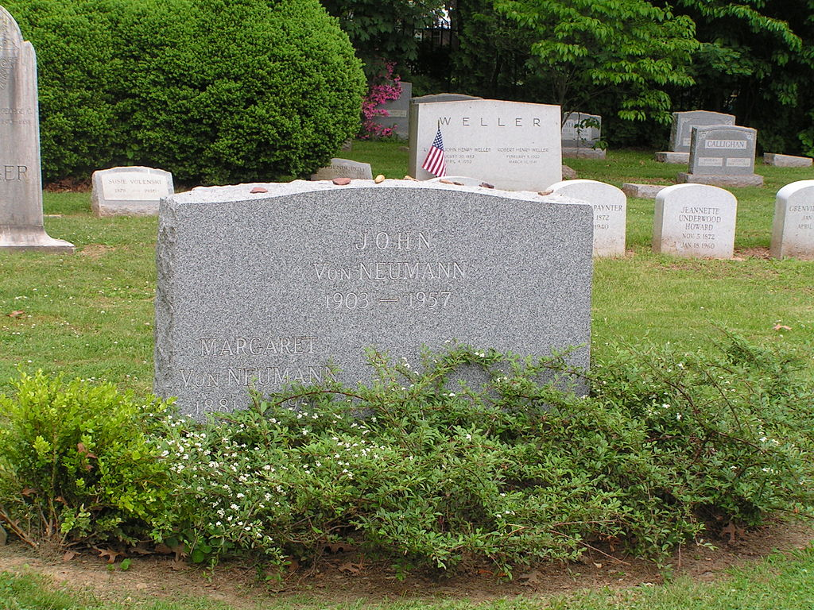

# John von Neumann

John von Neumann was born in Budapest. His work was in the field of 
mathematics and game theory. He is one of the fathers of modern computer 
science. Von Neumann died 1957 in Wahsington, D.C..

## Traits

* Mathetmatician
* Computer scientist
* Known for the Von Neumann architecture in computer hardware

> It would appear that we have reached the limits of what it is 
> possible to achieve with computer technology, although one 
> should be careful with such statements, as they tend to sound 
> pretty silly in 5 years.

